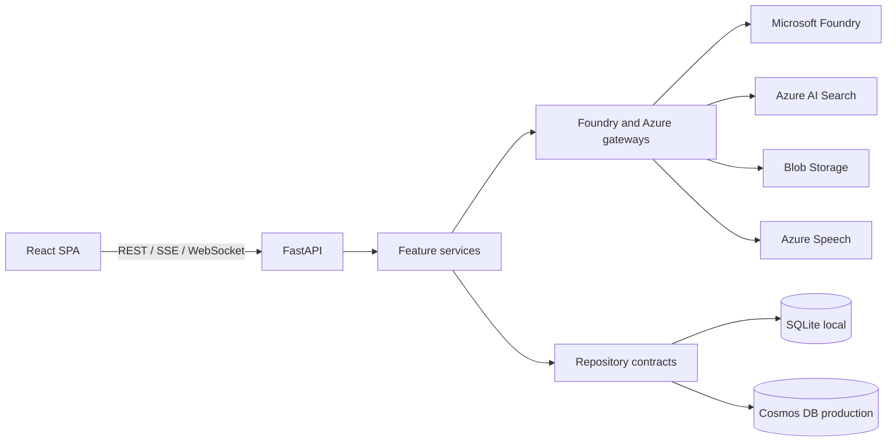

# Architecture

## Runtime

The frontend is a lazy-loaded application shell with feature-specific API modules and customer-facing
implementation guides under `frontend/src/features/`. FastAPI composes feature routers from
`app/features/`; reusable orchestration is in `app/services/`, provider boundaries in `app/gateways/`,
and storage behavior behind typed repository contracts.

## Data boundaries

- `PERSISTENCE_BACKEND=sqlite` is the local-development default; Azure deployments select `cosmos`.
- SQLite uses raw parameterized SQL and schema version `3`. Startup initializes the complete schema
  in one transaction. For this MVP, a version mismatch deliberately drops and recreates only the app
  tables in that same transaction and logs `development_mvp_reset=true`; no data migration is attempted.
- Production conversation data is stored in the versioned Cosmos container suffix `v3`. A schema
  change moves the app to a new container rather than migrating persisted MVP data.
- Tenant and user IDs form the ownership boundary and Cosmos partition key.
- Conversation listing uses a repository-neutral keyset cursor over `(updated_at DESC, id ASC)`;
  cursors contain validated stable values, not SQLite offsets or Cosmos continuation tokens.
- Cosmos conversations and messages share one owner partition. Appends use a transactional batch,
  and deletes query message IDs once before transactional delete batches of at most 100 operations.
- Original RAG documents use tenant/user-qualified Blob paths.
- Search chunks include filterable tenant and owner fields.
- Model settings are global by current product decision.

## Delivery

Pull requests run backend, frontend, infrastructure, secret, dependency, and image security gates.
Deployment builds a commit-tagged image, passes that immutable tag to Bicep, performs a smoke test,
and restores the previous image when smoke validation fails.

## Further reading

- [Threat model](threat-model.md)
- [Operations runbook](operations-runbook.md)
- [RBAC guidance](rbac.md)
- [Security policy](../SECURITY.md)
